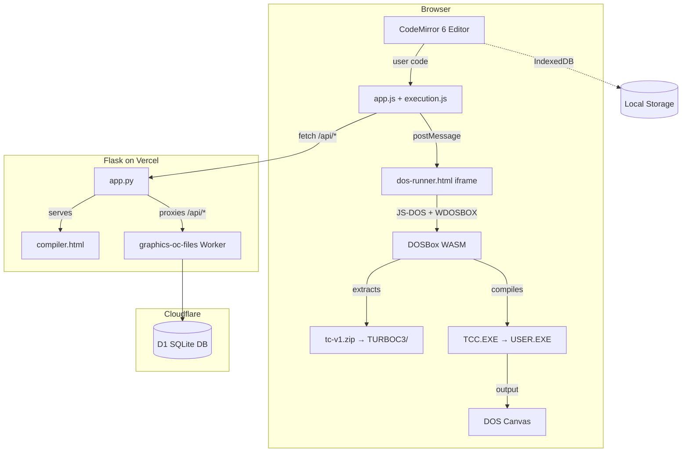

# Online Compiler — Developer Documentation

> Technical documentation for developers working on the **Graphics.h Online Compiler**. This covers how the system is built, how compilation works, how user data is stored, and how the website is deployed.

---

## What This Is

The Graphics.h Online Compiler lets users write and run **Turbo C++ graphics programs directly in the browser**. It runs a real Turbo C++ 3.0 compiler inside a DOS emulator (JS-DOS + WebAssembly) — there is no server-side compilation. Users can sign in with Google to save their files to the cloud.


---

## System Architecture



---

## Documentation Index

| Document | What It Covers |
|---|---|
| **[editor.md](editor.md)** | CodeMirror 6 integration — packages, build pipeline, autocomplete, tooltips, compartments, lazy loading, and how to build the editor bundle locally. |
| **[compiler.md](compiler.md)** | The compilation workflow — JS-DOS, WDOSBOX (WASM), tc.zip contents, the batch script, error polling, the `dos-runner.html` iframe, postMessage protocol, and asset fallbacks. |
| **[user-files.md](user-files.md)** | Cloud file storage — Cloudflare Worker architecture, D1 database schema, API endpoints, Flask proxy, IndexedDB, autosave logic, guest vs logged-in flow, and the file explorer UI. |
| **[website.md](website.md)** | Website infrastructure — Flask app structure, build pipeline (`build.py`), Vercel deployment, caching strategy, SEO, analytics, templates, security headers, and local development. |

---

## Quick Reference

### Key Files

| File | Purpose |
|---|---|
| `app.py` | Flask app entry point |
| `build.py` | Asset build pipeline (CSS/JS bundling + CodeMirror) |
| `vercel.json` | Vercel deployment configuration |
| `templates/compiler.html` | Main compiler page template |
| `static/dos-runner.html` | Isolated DOS emulator iframe |
| `static/js/compiler/editor.js` | CodeMirror editor setup |
| `static/js/compiler/execution.js` | Compile-and-run orchestration |
| `static/js/compiler/files.js` | File management + cloud sync |
| `static/js/compiler/autocomplete.js` | C function autocomplete + tooltips |
| `static/js/compiler/app.js` | Global state, settings, caching |
| `static/js/compiler/asset-sources.js` | CDN URLs + fallback resolution |
| `build-tools/codemirror/entry.js` | CodeMirror bundle entry point |
| `compiler-assets/zip-files/tc-v1.zip` | Turbo C++ 3.0 installation (3.1 MB) |
| `compiler-assets/libs/js-dos.js` | JS-DOS v6.22 runtime |
| `compiler-assets/libs/wdosbox.wasm.js` | DOSBox WebAssembly binary |
| `workers/graphics-oc-files/worker.js` | Cloudflare Worker entry point |
| `workers/graphics-oc-files/schema.sql` | D1 database schema |

### How Code Gets Compiled

```
User writes C++ → clicks "Run" → editor.getValue()
  → code saved (IndexedDB or cloud)
  → postMessage(INIT_DOS) to iframe
  → JS-DOS extracts tc-v1.zip into Emscripten FS
  → USER.CPP written to TURBOC3/BIN/
  → AUTOEXEC.BAT runs TCC.EXE with -I and -L flags
  → Success: USER.EXE runs → graphics output on canvas
  → Failure: ERR.TXT + FAIL.TXT → error panel in parent
```

### Build Commands

```bash
# Install all dependencies
npm install
pip install -r requirements.txt

# Build everything (CodeMirror bundle + hashed CSS/JS)
python build.py

# Run locally
python app.py
# → http://localhost:5000
```

### Deployment

Push to the main branch. Vercel automatically:
1. Runs `npm install`
2. Runs `pip install -r requirements.txt`
3. Runs `python build.py`
4. Deploys the Flask app + static assets

---

## Architecture Decisions

| Decision | Rationale |
|---|---|
| **Client-side compilation** | No server costs for compilation. The entire Turbo C++ toolchain runs in the browser via WASM. |
| **DOS in an iframe** | DOSBox captures mouse/keyboard globally. An iframe isolates these events from the editor and UI. |
| **CodeMirror 6 (not Ace)** | CM6 is modular, tree-shakeable, and supports dynamic reconfiguration via Compartments. |
| **ESM lazy-loading** | The CM6 bundle (~530KB) is loaded via `import()` so the page is interactive before the editor is fully ready. |
| **IndexedDB over localStorage** | localStorage is synchronous, limited to ~5MB, and blocks the main thread. IndexedDB is async and scales better. |
| **Cloudflare D1 + Workers** | Serverless, globally distributed, zero-maintenance SQLite. Worker handles auth + CRUD without touching the Flask app. |
| **Flask as a proxy** | The Flask app forwards `/api/*` to the Worker. This avoids CORS issues and keeps the Worker URL private. |
| **Hashed filenames** | Enables aggressive CDN caching (1 year, immutable) while guaranteeing instant cache invalidation on deploy. |
| **Multi-CDN asset fallbacks** | Critical assets (tc.zip, JS-DOS) are hosted on R2, Vercel Blob Storage, and locally. If one CDN is down, the next is tried. |

---

*Navigate to any of the linked documents above for deep technical details.*

*Last updated: May 2026*
