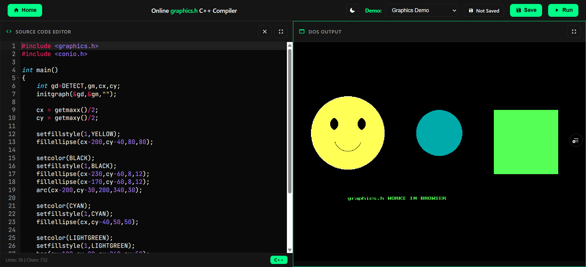
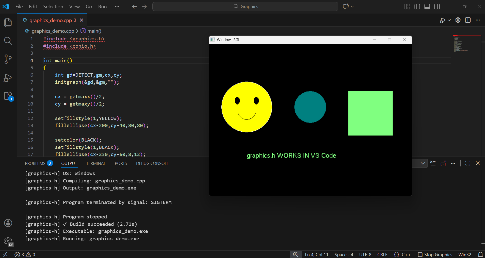

<div align="center">

# 🎨 Graphics.h Compiler

### Run graphics.h programs in your browser or VS Code - no setup required

[](https://graphics-h-compiler.vercel.app/)
[](https://marketplace.visualstudio.com/items?itemName=AlbatrossC.graphics-h-compiler)
[](https://github.com/AlbatrossC/graphics-h-compiler)

**A modern Turbo C wrapper for graphics.h programming**  
*No Turbo C • No DOSBox • No Legacy Tools*

[🚀 Quick Start](#getting-started) • [📖 Documentation](#documentation) • [💡 Features](#features) • [🎯 Why This Exists](#why-this-project-exists)

</div>

---

---

<div align="center">

## 📸 Screenshots

### 🌐 Browser Interface



### 💻 VS Code Extension



</div>

---

<div align="center">

## 🌟 Overview

**Graphics.h Compiler** is a modern Turbo C wrapper that brings the classic `graphics.h` library to contemporary development environments. Write, compile, and run graphics programs directly in your browser or VS Code—no complex setup, no legacy tools, no headaches.

> **Perfect for students, educators, and anyone learning computer graphics programming**

</div>

---

<div align="center">

## ✨ Features

<table>
<tr>
<td width="50%">

### 🌐 Multi-Platform Support
- Browser-based compiler
- VS Code extension
- Cross-platform compatibility
- Windows, Linux

</td>
<td width="50%">

### ⚡ Zero Configuration
- No Turbo C installation
- No DOSBox required
- Client-side execution
- Instant setup

</td>
</tr>
<tr>
<td width="50%">

### 📴 Offline Ready
- Works after initial load
- No internet dependency
- Local development support

</td>
<td width="50%">

### 🎓 Student Friendly
- SPPU syllabus compatible
- Simple interface
- Modern workflow
- Focus on learning

</td>
</tr>
</table>

</div>

---

<div align="center">

## 🎯 Why This Project Exists

**`graphics.h` is still part of the SPPU Computer Graphics syllabus (2024 revised)**

</div>

Despite being widely taught, `graphics.h` programming creates significant barriers for students:

<div align="center">

| ❌ Problem | ✅ Solution |
|-----------|----------|
| Complex Turbo C installation | Browser-based, instant access |
| DOSBox configuration headaches | Zero configuration required |
| OS compatibility issues | Cross-platform support |
| Time wasted on setup | Focus on learning graphics concepts |

**This project removes these obstacles** so students and educators can concentrate on what matters: understanding graphics programming fundamentals.

</div>

---

<div align="center">

## 🚀 Usage Options

<table>
<tr>
<td align="center" width="33%">
<h3>🌐</h3>
<b>Online</b><br>
<sub>No setup required</sub>
</td>
<td align="center" width="33%">
<h3>💻</h3>
<b>Local Browser</b><br>
<sub>Run on localhost</sub>
</td>
<td align="center" width="33%">
<h3>📝</h3>
<b>VS Code</b><br>
<sub>IDE integration</sub>
</td>
</tr>
</table>

</div>

---

<div align="center">

## 🏁 Getting Started

### Option 1: 🌐 Online Compiler (Recommended)

The fastest way to get started—just click and code!

[](https://graphics-h-compiler.vercel.app/)

</div>

---

<div align="center">

### Option 2: 💻 Run Locally

Clone and run on your machine:

</div>

```bash
# Clone the repository
git clone https://github.com/AlbatrossC/graphics-h-compiler.git

# Navigate to the project directory
cd graphics-h-compiler

# Start a local server
python -m http.server 8000
```

<div align="center">

**Then open:** [`http://localhost:8000`](http://localhost:8000)

</div>

---

<div align="center">

### Option 3: 📝 VS Code Extension

Install the extension for integrated development:

[](https://marketplace.visualstudio.com/items?itemName=AlbatrossC.graphics-h-compiler)

#### Installation Methods:

**🖱️ Via VS Code:**
1. Open VS Code
2. Press `Ctrl+Shift+X` to open Extensions
3. Search for **"graphics.h compiler"**
4. Click **Install** on the extension by **AlbatrossC**

**⌨️ Via Command Line:**
```bash
code --install-extension AlbatrossC.graphics-h-compiler
```

> 📖 For detailed configuration, see [`vscode-compiler.md`](vscode-compiler.md)

</div>

---

<div align="center">

## 📖 Documentation

<table>
<tr>
<td align="center" width="50%">

### 🌐 Online Compiler Guide
[`online-compiler.md`](online-compiler.md)

Browser-based compiler architecture, features, and usage instructions

</td>
<td align="center" width="50%">

### 💻 VS Code Extension Guide
[`vscode-compiler.md`](vscode-compiler.md)

Extension setup, configuration, and advanced features

</td>
</tr>
</table>

</div>

---

<div align="center">

## 👥 Who Is This For?

<table>
<tr>
<td align="center" width="33%">

### 🎓
**SPPU Students**

Meet syllabus requirements without legacy tools

</td>
<td align="center" width="33%">

### 👨‍💻
**Beginners**

Learn graphics.h without configuration hassles

</td>
<td align="center" width="33%">

### 👨‍🏫
**Educators**

Provide students with modern, accessible tools

</td>
</tr>
</table>

</div>

---

<div align="center">

## ⚙️ Technical Details

This compiler leverages **WebAssembly** technology to emulate the Turbo C graphics library environment. It enables `graphics.h` programs to run seamlessly in modern browsers and development tools without requiring DOS emulation, virtualization, or any legacy dependencies.

**Key Technologies:**
- WebAssembly for C/C++ compilation
- Browser-based graphics rendering
- Modern JavaScript framework integration

</div>

---

## 💬 Support & Community

<div align="center">

| Need Help? | Action |
|------------|--------|
| 🐛 Found a bug | [Report an Issue](https://github.com/AlbatrossC/graphics-h-compiler/issues) |
| 💡 Have a question | [Start a Discussion](https://github.com/AlbatrossC/graphics-h-compiler/discussions) |
| ⭐ Like this project | [Star on GitHub](https://github.com/AlbatrossC/graphics-h-compiler) |

</div>

---

<div align="center">

**Graphics.h Compiler** • Simplifying graphics programming for modern developers

[](LICENSE)
[](https://github.com/AlbatrossC/graphics-h-compiler)

*Built for students • Made for learning • Designed for simplicity*

</div>