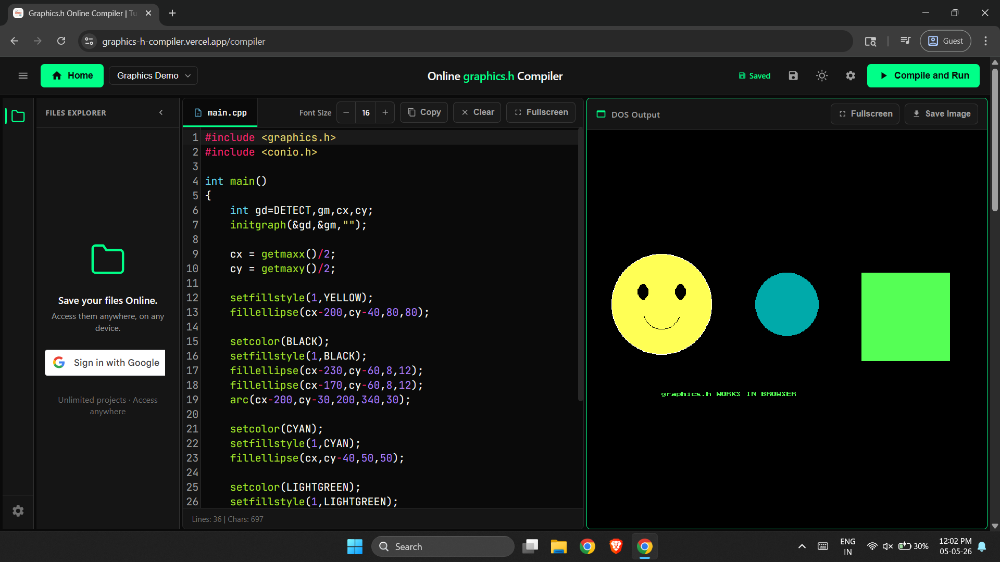
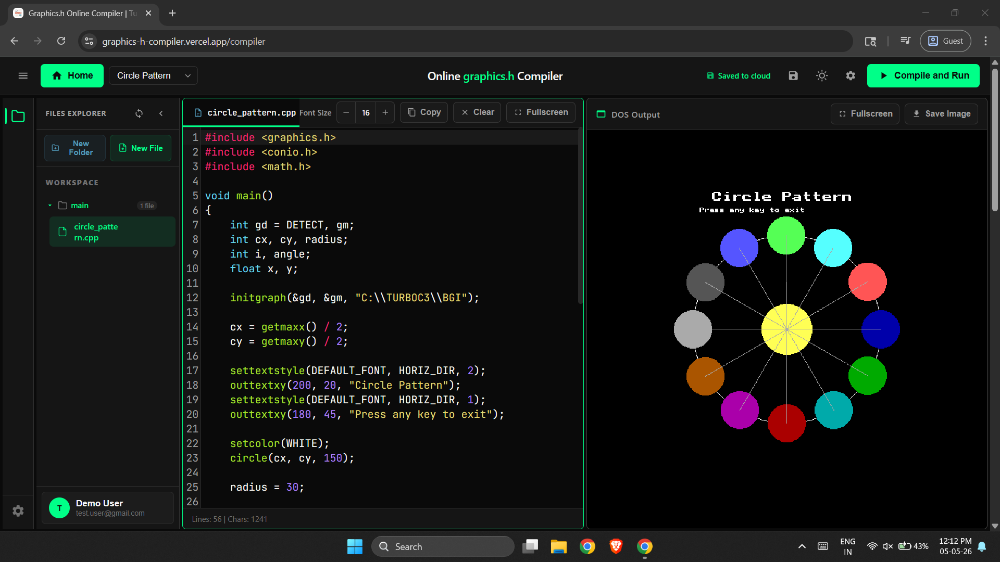
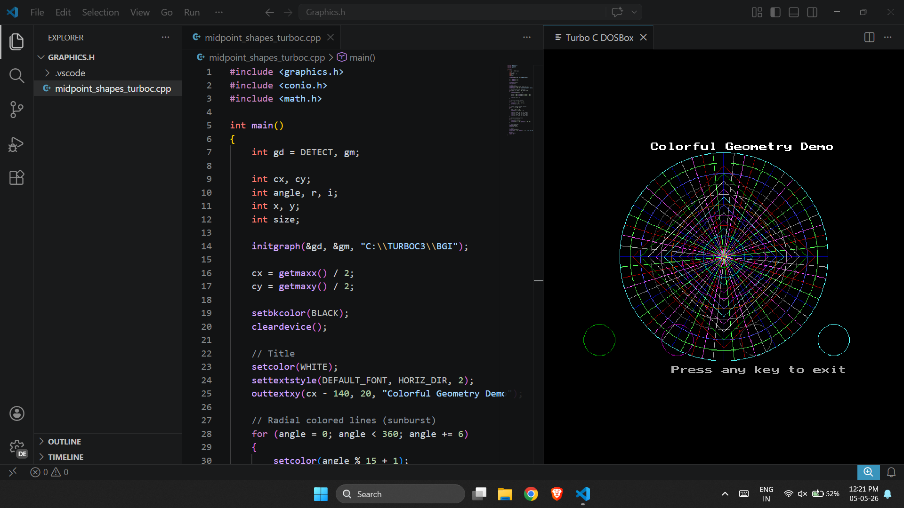
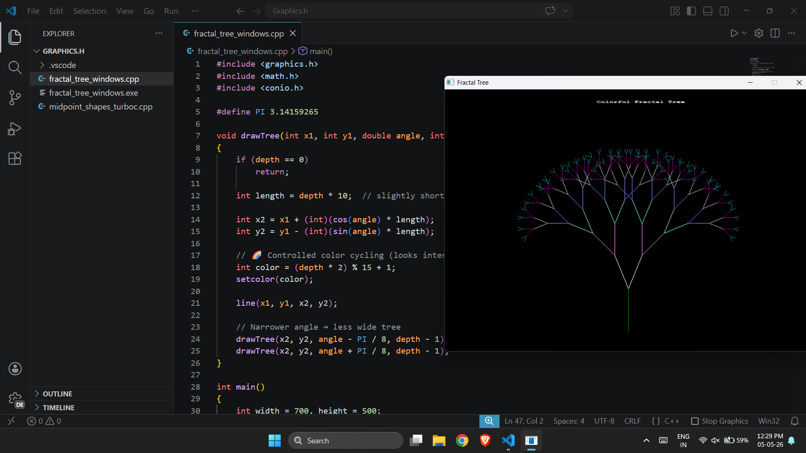

<div align="center">

<br>


<br><br>

<h4>Run Turbo C++ graphics programs in your browser or VS Code<br>Zero setup · No DOSBox · No installers</h4>

<br>

<table>
  <tr>
    <td>
      <a href="https://marketplace.visualstudio.com/items?itemName=AlbatrossC.graphics-h-compiler">
        
      </a>
    </td>
    <td>&nbsp;&nbsp;&nbsp;</td>
    <td>
      <a href="https://graphicsh.online/compiler">
        
      </a>
    </td>
  </tr>
</table>

<br>

</div>

<br>

## 📖 What is this?

**`graphics.h`** is a DOS-era C/C++ graphics library from Borland Turbo C++ (circa 1992). While decades old, it remains a core part of the computer science curriculum for hundreds of thousands of engineering students.

Getting it to run on modern operating systems has traditionally meant hunting down old Turbo C++ installers, wrestling with DOSBox configuration files, and spending more time troubleshooting than actually learning.

**This project fixes all of that.** It runs the original `TCC.EXE` (Turbo C++ 3.0) via DOSBox compiled to WebAssembly — entirely client-side. Write, compile, and see graphics output right in your browser or VS Code. Nothing to install.

<br>

---

<br>

## 🌐 Online Compiler

> A modern, interactive development environment — right in your browser.

<br>

<div align="center">

#### ✍️ Write Code → Click Run → See Output



<sub>CodeMirror 6 editor with C++ syntax highlighting, autocomplete, and inline documentation for all 99 <code>graphics.h</code> functions.</sub>

</div>

<br>

<div align="center">

#### ☁️ Save Your Work to the Cloud



<sub>Sign in with Google to organize programs into folders and sync across devices.</sub>

</div>

<br>

<details>
<summary>&nbsp;<b>📋 Features at a glance</b></summary>

<br>

| Feature | Details |
| :--- | :--- |
| **Genuine Turbo C++ 3.0** | Runs `TCC.EXE` within DOSBox WebAssembly for exact output. |
| **Full API Support** | All 99 functions — `initgraph`, `circle`, `arc`, `bar3d`, `floodfill`, fonts, and more. |
| **Smart Editor** | Autocomplete, parameter hints, syntax highlighting, and hover docs. |
| **Cloud Sync** | Save files and folders to the cloud with Google Sign-In. |
| **PWA & Offline** | Assets are cached after first visit — compile and run offline. |
| **Standalone Build** | A [single HTML file](../site/compiler-assets/unified/graphic.h-compiler-unified.html) (~8 MB) that works completely offline. |

</details>

<br>

> [!TIP]
> **Need something portable?** Download the [standalone unified build](../site/compiler-assets/unified/graphic.h-compiler-unified.html) — a single self-contained HTML file. No server, no internet needed.  
> [Read the technical breakdown →](../site/compiler-assets/unified/graphic.h-compiler-unified.md)

<br>

---

<br>

##  VS Code Extension

> Compile and run C++ graphics programs directly inside your editor — two modes, one shortcut.

<br>

<div align="center">

#### ⚙️ Mode 1 · Turbo C++ (DOSBox Webview)



<sub>Compiles using the real Turbo C++ 3.0 in an integrated webview panel. Pixel-perfect DOS graphics output.</sub>

</div>

<br>

<div align="center">

#### ⚡ Mode 2 · WinBGI (Native Windows)



<sub>Compiles via MinGW-w64 (GCC 11.5.0) to a native executable with a real Win32 graphics window. Toolchain auto-installs on first use.</sub>

</div>

<br>

<details>
<summary>&nbsp;<b>📋 Features at a glance</b></summary>

<br>

| Feature | Details |
| :--- | :--- |
| **Dual Compilation** | Switch between Turbo C++ (DOSBox) and WinBGI (Native Windows). |
| **Auto Setup** | MinGW-w64 toolchain downloads and configures itself automatically. |
| **Keyboard Shortcut** | `Ctrl + Alt + N` to compile and run instantly. |
| **Error Diagnostics** | GCC error highlights inline in your code and the Problems panel. |
| **Cross-Platform** | Windows (native), macOS (Turbo C mode), Linux (via Wine). |
| **Status Bar** | Run and stop controls right in the VS Code status bar. |

</details>

<br>

### 📥 Install the Extension

**1 &nbsp;·&nbsp;** Install directly from the **[VS Code Marketplace →](https://marketplace.visualstudio.com/items?itemName=AlbatrossC.graphics-h-compiler)**

**2 &nbsp;·&nbsp;** Or install via terminal:

```bash
code --install-extension AlbatrossC.graphics-h-compiler
```

**3 &nbsp;·&nbsp;** Or search manually: open VS Code → `Ctrl+Shift+X` → search **"graphics.h compiler"** → **Install**.

<br>

---

<br>

## 💻 Code Example

Paste this into the [online compiler](https://graphicsh.online/compiler) and hit **Run**:

```c
#include <graphics.h>
#include <conio.h>

int main() {
    int gd = DETECT, gm;
    initgraph(&gd, &gm, "");

    // Draw a yellow circle
    setcolor(YELLOW);
    circle(320, 240, 100);

    // Draw a cyan rectangle
    setcolor(LIGHTCYAN);
    rectangle(200, 120, 440, 360);

    // Draw a green diagonal line
    setcolor(LIGHTGREEN);
    line(100, 50, 540, 430);

    // Render text output
    setcolor(WHITE);
    outtextxy(250, 420, "It works!");

    getch();
    closegraph();
    return 0;
}
```

A graphics window appears in seconds — that's `TCC.EXE` from 1992, compiled to WebAssembly, running in your browser.

<br>

---

<br>

## 🚀 Getting Started

**No install needed — just open:**

> **→ &nbsp; [graphicsh.online/compiler](https://graphicsh.online/compiler)**

<br>

---

<br>

## 🖥️ Running Locally

> **Prerequisites:** [Git](https://git-scm.com/), [Node.js](https://nodejs.org/) (v18+), and [Python 3](https://www.python.org/).

<br>

**1 &nbsp;·&nbsp; Clone the repository**

```bash
git clone https://github.com/AlbatrossC/graphics-h-compiler.git
cd graphics-h-compiler
```

**2 &nbsp;·&nbsp; Install dependencies & build**

```bash
npm install
npm run build
```

> `npm run build` invokes the Python build script (`build-tools/build.py`) and bundles everything into the `dist/` directory.

**3 &nbsp;·&nbsp; Serve the output**

```bash
cd dist
npx serve .
```

Open the URL shown in your terminal (typically **`http://localhost:3000/compiler`**).

<br>

---

<br>

## 🧰 Tech Stack

| Layer | Technology |
| :--- | :--- |
| **Compiler** | Turbo C++ 3.0 (`TCC.EXE`) via [js-dos](https://js-dos.com/) (DOSBox WASM) |
| **Editor** | [CodeMirror 6](https://codemirror.net/) with C++ language support |
| **Bundler** | [esbuild](https://esbuild.github.io/) |
| **Build** | Python build script + npm |
| **VS Code Extension** | TypeScript, Webview API, MinGW-w64 toolchain |
| **Hosting** | [Cloudflare Workers](https://workers.cloudflare.com/) |

<br>

---

<br>

## 🛠️ Developer Docs

> Want to contribute or understand the internals? Start here.

| Section | Link | What's covered |
| :--- | :--- | :--- |
| **Online Compiler** | [Docs →](online-compiler/readme.md) | JS-DOS WASM integration, CodeMirror config, deployment |
| **VS Code Extension** | [Docs →](vscode-extension/vscode-compiler.md) | Extension architecture, Turbo C / WinBGI modes, packaging |

Contributions welcome — [open an issue](https://github.com/AlbatrossC/graphics-h-compiler/issues) or send a PR.

<br>

---

<div align="center">

<br>

Made with frustration and love by **[AlbatrossC](https://github.com/AlbatrossC)**

*If this saved you from a DOSBox config spiral, a ⭐ on GitHub means a lot.*

<br>

</div>
