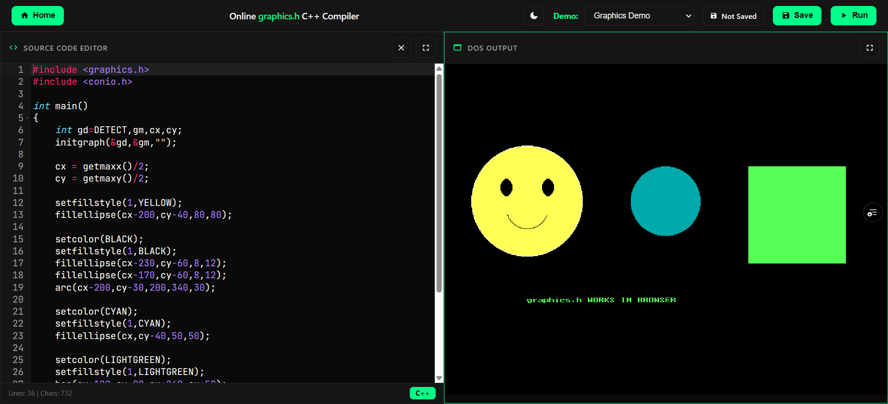
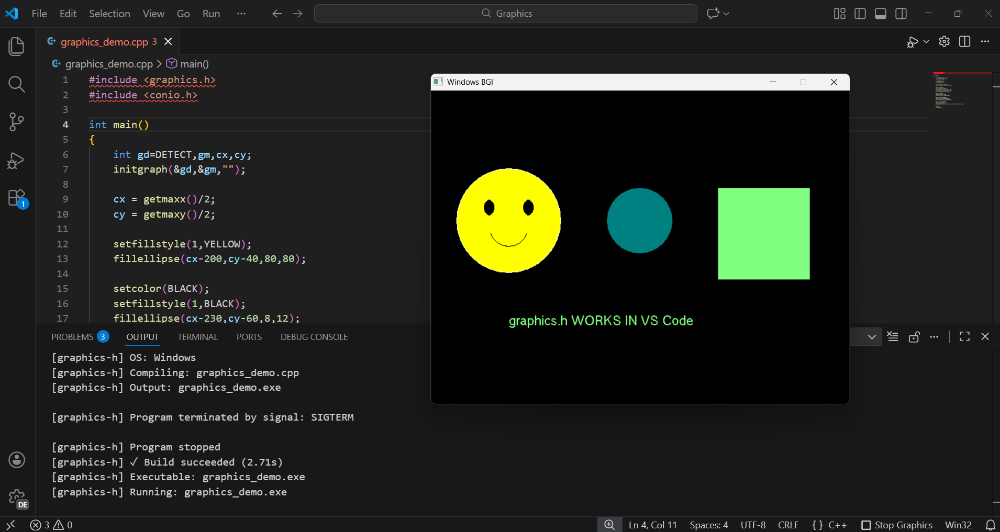

<div align="center">

# Graphics.h Compiler

**A modern web-based compiler for running graphics.h programs in the browser and VS Code, with no installation or configuration needed.**

[](https://graphics-h-compiler.vercel.app/)
[](https://marketplace.visualstudio.com/items?itemName=AlbatrossC.graphics-h-compiler)
[](https://github.com/AlbatrossC/graphics-h-compiler)

</div>

---

## 📸 Screenshots

### Browser Interface


### VS Code Extension


---

## 🎯 Overview

Graphics.h Compiler is a modern Turbo C wrapper that enables you to compile and run `graphics.h` programs directly in your browser or VS Code. It eliminates the complexity of traditional setup methods and provides a ready-to-use graphics programming environment for learning and experimentation.

**Key Benefits:**
- ✅ No Turbo C installation required
- ✅ No DOSBox configuration needed
- ✅ Cross-platform support (Windows, Linux)
- ✅ Works offline after initial load
- ✅ SPPU Computer Graphics syllabus compatible

---

## ✨ Features

**Browser-Based Compilation**  
Run graphics programs directly in your web browser with zero installation.

**VS Code Integration**  
Develop with full IDE support through our dedicated extension.

**Zero Configuration**  
No complex setup or legacy dependencies required - just start coding.

**Client-Side Execution**  
All compilation happens locally in your browser for privacy and speed.

**Offline Support**  
Continue working without internet connectivity after the initial load.

**Modern Workflow**  
Use contemporary development tools with legacy graphics.h code seamlessly.

---

## 💡 Why This Project Exists

The `graphics.h` library remains a core component of the **SPPU Computer Graphics syllabus (2024 revised)** and is widely taught in introductory programming courses. However, its reliance on legacy tooling creates significant barriers for students.

<div align="center">

| ❌ Problem | ✅ Solution |
|:-----------|:------------|
| Complex Turbo C installation | Browser-based, instant access |
| DOSBox configuration issues | Zero configuration required |
| OS compatibility problems | Cross-platform support |
| Time wasted on setup | Focus on learning concepts |

</div>

This project removes these obstacles, allowing students and educators to focus on graphics programming fundamentals rather than technical configuration.

---

## 🚀 Getting Started

### Option 1: Online Compiler (Recommended)

The fastest way to get started. Simply visit the online compiler and begin coding immediately:

👉 **[https://graphics-h-compiler.vercel.app/](https://graphics-h-compiler.vercel.app/)**

---

### Option 2: Run Locally (For Developers)

The web app is powered by **Flask** (Python). Follow these steps to run the full application on your machine:

#### Prerequisites

- **Python 3.8+** — [Download](https://www.python.org/downloads/)
- **Node.js ≥ 16.x** and **npm ≥ 8.x** — [Download](https://nodejs.org/) (only needed if you want to rebuild the CodeMirror editor bundle)
- **Git** — [Download](https://git-scm.com/)

#### Steps

```bash
# 1. Clone the repository
git clone https://github.com/AlbatrossC/graphics-h-compiler.git
cd graphics-h-compiler

# 2. Install Python dependencies
pip install -r requirements.txt

# 3. Create a .env file (see Environment Variables below)
#    At minimum, you can start with an empty .env file for basic usage
copy NUL .env          # Windows
# touch .env           # macOS/Linux

# 4. Start the Flask development server
python app.py
```

The server starts on **`http://localhost:5000`**. Open your browser and navigate to:

| Page | URL |
|------|-----|
| Landing page | `http://localhost:5000/` |
| Compiler | `http://localhost:5000/compiler` or `http://localhost:5000/compiler.html` |
| Documentation | `http://localhost:5000/docs` |
| Embed widget | `http://localhost:5000/embed` |

> **Note:** `python app.py` starts Flask on `0.0.0.0:5000` (accessible from all network interfaces). For local-only access, you can modify the `app.run()` call in `app.py`.

#### Environment Variables

Create a `.env` file in the project root. The app will run without these (with reduced functionality), but full features require them:

| Variable | Required | Description |
|----------|----------|-------------|
| `SUPABASE_URL` | For auth | Your Supabase project URL |
| `SUPABASE_ANON_KEY` | For auth | Supabase public (anon) API key |
| `STORAGE_WORKER_URL` | For cloud save | URL to the Cloudflare Worker that handles file storage |
| `DISCORD_WEBHOOK_URL` | For contact form | Discord webhook URL for receiving contact form messages |
| `MAINTENANCE_MODE` | Optional | Set to `true` to enable maintenance mode (redirects all pages to maintenance page) |

Without these variables:
- **No `.env` at all** — The compiler and editor work fully. Google Sign-In, cloud file save, and the contact form will be disabled.
- **Only `SUPABASE_URL` + `SUPABASE_ANON_KEY`** — Google Sign-In works, but cloud file storage requires `STORAGE_WORKER_URL` as well.

---

### Option 3: VS Code Extension

Install the extension directly from the Visual Studio Code Marketplace:

👉 **[Install Extension](https://marketplace.visualstudio.com/items?itemName=AlbatrossC.graphics-h-compiler)**

#### Installation Methods:

**Via VS Code:**
1. Open VS Code
2. Press `Ctrl+Shift+X` to open Extensions panel
3. Search for **"graphics.h compiler"**
4. Click **Install** on the extension by **AlbatrossC**

**Via Command Line:**
```bash
code --install-extension AlbatrossC.graphics-h-compiler
```

📖 For detailed configuration and usage, refer to [vscode-compiler.md](vscode-compiler.md)

---

## 📁 Project Structure

```
graphics.h-online-compiler/
├── app.py                        ← Flask entry point (routes, APIs, proxy)
├── requirements.txt              ← Python dependencies (flask, python-dotenv, requests)
├── .env                          ← Environment variables (not committed)
├── vercel.json                   ← Vercel deployment config
├── package.json                  ← Node.js dependencies (CodeMirror, esbuild)
├── esbuild.mjs                   ← Bundles CodeMirror into a single JS file
│
├── templates/                    ← Jinja2 HTML templates served by Flask
│   ├── index.html                ← Landing page
│   ├── compiler.html             ← Main compiler page
│   ├── embed.html                ← Embeddable compiler widget
│   ├── embed-docs.html           ← Embeddable docs widget
│   ├── docs.html                 ← Documentation hub page
│   ├── base.html                 ← Base template for doc pages
│   ├── maintenance.html          ← Maintenance mode page
│   └── docs/                     ← Individual doc page templates
│
├── static/                       ← Static assets served at /static/
│   ├── js/
│   │   ├── compiler/             ← Source JS modules
│   │   │   ├── core.js           ← Logger, constants, metrics
│   │   │   ├── editor.js         ← CodeMirror 6 setup & extensions
│   │   │   ├── runtime.js        ← iframe bridge, run/stop orchestration
│   │   │   ├── storage.js        ← Auth, cloud storage, IndexedDB cache
│   │   │   ├── theme-engine.js   ← Theme definitions & switching
│   │   │   ├── settings.js       ← User settings panel
│   │   │   └── cm-entry.js       ← esbuild entry point for CodeMirror
│   │   └── codemirror.bundle.v1.js  ← Bundled CodeMirror (generated)
│   ├── dos-runner.html           ← Sandboxed iframe for JS-DOS / DOSBox
│   ├── css/                      ← Stylesheets
│   ├── favicon.ico
│   └── ...
│
├── compiler-assets/              ← Assets used by the compiler
│   ├── libs/                     ← JS-DOS runtime files (js-dos.js, wdosbox.js, etc.)
│   ├── Demo_files/               ← Sample .cpp demo programs
│   ├── graphics/                 ← graphics.h, winbgim.h, libbgi.a
│   ├── Installers/               ← Linux install script
│   └── zip-files/                ← tc.zip (Turbo C environment)
│
├── TURBOC3/                      ← Turbo C++ 3.0 environment (BIN/, INCLUDE/, LIB/)
│
├── VScodeExtension/              ← VS Code extension source (TypeScript)
│
├── workers/                      ← Cloudflare Workers
│   ├── graphics-oc-users-files/  ← File storage worker (R2 + JWT auth)
│   ├── graphics-compiler-users-worker/  ← User management worker
│   └── r2-public-assets/         ← Public asset serving
│
├── docs/                         ← Developer documentation (this folder)
│   ├── readme.md                 ← This file
│   ├── online-compiler.md        ← Online compiler technical docs
│   ├── vscode-compiler.md        ← VS Code extension technical docs
│   └── editor.md                 ← CodeMirror 6 editor architecture
│
└── data/                         ← Data files
```

---

## 📚 Documentation

| Document | Description |
|----------|-------------|
| **[readme.md](readme.md)** | This file — project overview, setup, and contributor guide |
| **[online-compiler.md](online-compiler.md)** | Technical deep-dive into the browser-based compiler architecture |
| **[vscode-compiler.md](vscode-compiler.md)** | VS Code extension internals, toolchain, and build process |
| **[editor.md](editor.md)** | CodeMirror 6 editor setup, bundling, and theme system |

---

## 💻 Usage Example

The compiler provides an intuitive interface for writing and running graphics.h programs. Simply write your code and click compile to see results instantly.

```c
#include <graphics.h>
#include <conio.h>

int main() {
    int gd = DETECT, gm;
    initgraph(&gd, &gm, "");
    
    // Draw a circle
    circle(250, 200, 50);
    
    // Draw a rectangle
    rectangle(150, 100, 350, 300);
    
    // Draw a line
    line(100, 50, 400, 350);
    
    getch();
    closegraph();
    return 0;
}
```

---

## 🔧 Tech Stack

| Layer | Technology |
|-------|------------|
| **Backend** | Flask (Python) on Vercel Serverless |
| **Templating** | Jinja2 |
| **Code Editor** | CodeMirror 6 (bundled via esbuild) |
| **DOS Emulator** | JS-DOS 6.22 + WebAssembly DOSBox |
| **Compiler** | Turbo C++ 3.0 (`TCC.EXE`) inside emulated DOS |
| **File Hosting** | Vercel Blob Storage (tc.zip) |
| **Cloud Files** | Cloudflare Workers + R2 |
| **Auth** | Supabase (Google OAuth) |
| **Caching** | IndexedDB (tc.zip) · LocalStorage (code, demos) |
| **Deployment** | Vercel (web app) · Cloudflare (workers) |

---

## 🛠️ Developer Guide

### Rebuilding the CodeMirror Bundle

The editor uses a pre-built CodeMirror bundle (`static/js/codemirror.bundle.v1.js`). If you modify any CodeMirror-related code (extensions, keybindings, etc.), rebuild it:

```bash
# Install Node.js dependencies (first time only)
npm install

# Run the esbuild bundler
node esbuild.mjs
```

This reads `static/js/compiler/cm-entry.js` and outputs the minified bundle to `static/js/codemirror.bundle.v1.js`.

### Flask Routes Overview

All routes are defined in `app.py`. Key routes:

| Route | Method | Handler |
|-------|--------|---------|
| `/` , `/index.html` | GET | Landing page |
| `/compiler` , `/compiler.html` | GET | Compiler page |
| `/docs` | GET | Documentation hub |
| `/docs/<slug>` | GET | Individual doc page |
| `/embed` , `/embed.html` | GET | Embeddable compiler |
| `/api/auth/config` | GET | Returns Supabase credentials to frontend |
| `/files/<path>` | GET/POST/DELETE | Proxies requests to Cloudflare storage worker |
| `/api/contact` | POST | Forwards contact form submissions to Discord |
| `/libs/<path>` | GET | Serves JS-DOS library files from `compiler-assets/libs/` |

### Cloudflare Workers

The project uses three Cloudflare Workers (in `workers/`):

| Worker | Purpose |
|--------|---------|
| `graphics-oc-users-files` | File save/load/delete via R2 — JWT tokens are verified locally using HMAC-SHA256 |
| `graphics-compiler-users-worker` | User account management |
| `r2-public-assets` | Serves public assets from R2 (e.g., tc.zip) |

To develop workers locally:

```bash
cd workers/graphics-oc-users-files
npm install
npx wrangler dev
```

Set secrets with `npx wrangler secret put <KEY>`.

### Deployment

**Web app (Vercel):**
- Push to `main` → Vercel auto-deploys via `vercel.json`
- Flask is deployed as a serverless function via `@vercel/python`
- Static files are served directly via `@vercel/static`

**Workers (Cloudflare):**
```bash
cd workers/graphics-oc-users-files
npx wrangler deploy
```

---

## 👥 Who Is This For?

**Students**  
SPPU Computer Graphics students who need to fulfill syllabus requirements without hassle.

**Beginners**  
Anyone learning graphics.h who wants to avoid complex configuration and focus on coding.

**Educators**  
Instructors who want to provide students with modern, accessible development tools.

---

## 🤝 Support

Need help or want to contribute?

- 🐛 **[Report a Bug](https://github.com/AlbatrossC/graphics-h-compiler/issues)**
- 💬 **[Ask a Question](https://github.com/AlbatrossC/graphics-h-compiler/discussions)**
- ⭐ **[Star this Repository](https://github.com/AlbatrossC/graphics-h-compiler)**

---

<div align="center">

### Built for students and educators

**Graphics.h Compiler** - Making graphics.h accessible for everyone

</div>